<picture>
  <source media="(prefers-color-scheme: dark)" srcset="header-dark.svg">
  <source media="(prefers-color-scheme: light)" srcset="header-light.svg">
  
</picture>

<br>

```bash
$ whoami
Ashfaq Naseem — full-stack TypeScript dev, backend-leaning
Stack: Node.js (Fastify, NestJS) · Go · Next.js/React · React Native
Focus right now: Automation & AI
```

<details>
<summary><b>More about me</b></summary>

<br>
I am a self taught full-stack developer based in Bangladesh. I have been building software since 2017, starting out by figuring things out on my own and learning through real world projects.

These days, my main focus has shifted toward backend systems and automation. I enjoy solving practical problems, streamlining workflows, and building things that work reliably in production.

</details>

## What I'm building

| Project | What it does | Stack |
|---|---|---|
| **Price-comparison platform** | Aggregates product listings across many e-commerce sites. | TypeScript · Fastify · Redis |
| [**GitHub Desktop, forked**](https://github.com/desktop-plus/desktop-plus) | Contributed a little | React · Electron |

*(Price-comparison platform repo will be linked once public.)*

## Toolkit

**Languages & frameworks**
<p>
  
  
  
  
  
  
</p>

**Backend & data**
<p>
  
  
  
  
  
  
  
  
  
  
</p>

**Mobile, infra & automation**
<p>
  
  
  
  
</p>


## Activity
<br>
<p align="center">
  
  &nbsp;&nbsp;
  
</p>
<p align="center">
  
</p>


## Get in touch

<p align="center">
  <a href="https://anaseeem.vercel.app/">
    
  </a>
  <a href="https://www.linkedin.com/in/ashfaq-naseem-959856260/">
    
  </a>
  <a href="mailto:ashfaqnaseem1@gmail.com">
    
  </a>
</p>
